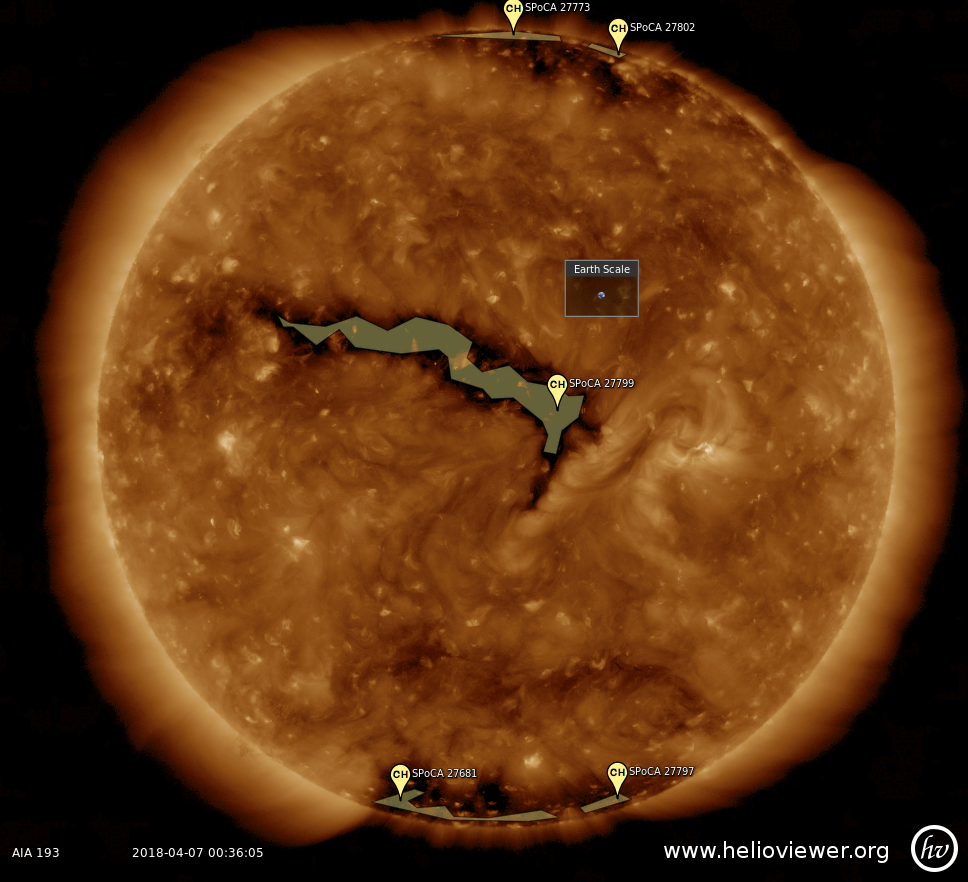
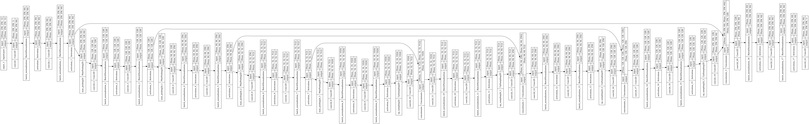

# CHeSS: Coronal Hole Semantic Segmentation

## Deep Learning applied to semantic segmentation of solar coronal hole



### Project description

This project is an attempt at applying U-Net-based architectures for the detection and segmentation of coronal holes (CHs). 
The training set is created from the Heliophysics Knowledge Based (HEK) using the results of the [SPOCA algorithm](https://www.aanda.org/articles/aa/abs/2014/01/aa21243-13/aa21243-13.html).
Human intervention intervienes on top of the SPOCA results to refine the boundaries according to the accepted phenomenology that defines CHs. 
Therefore, our Deep Learning architecture is not learning directly from the SPOCA results, but from an augmented training set that is closer to the ground truth. 
This minimizes the risk of learning biases inherent to the SPOCA algorithm.

The graph below illustrates one of our UNet architectures: 




## Authors: 
- Dr. Raphael Attie @ NASA/GSFC & George Mason University
- Dr. Michael Kirk @ NASA/GSFC

---
# DALI contributions
Install dependencies: 
```
pip install -r requirements.txt
```

Export path to data, here is my example:
```
export DATA_PATH=/home/aderylo/2011/01/
```

Before training you have to convert npz files to npy in label subfolder. 
```
python convert_npz_to_npy.py
```

To start training:
```
python UNet/train.py
```

If running with DALI:
```
python UNet/train.py --use_dali
```